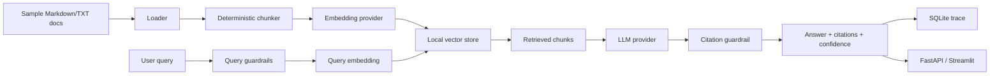

# Architecture

## Design Goals

This V1 is built to be credible, inspectable, and runnable on a laptop. It avoids pretending to be a full enterprise platform while still showing the engineering patterns expected in production GenAI systems.

Key choices:

- local-first execution;
- deterministic mock providers by default;
- explicit provider interfaces for embeddings and LLM generation;
- source-aware chunking and citations;
- evaluation as a first-class workflow;
- local traces for observability;
- simple guardrails that are easy to test.

## Components

### Backend API

FastAPI exposes:

- `GET /health`
- `POST /ingest`
- `POST /query`
- `POST /evaluate`
- `GET /metrics`
- `GET /traces`

Schemas live in `src/rag_compliance_assistant/api/schemas.py`.

### Ingestion

The ingestion layer loads Markdown and TXT files from `data/sample_docs`, extracts a title, creates stable document IDs, and chunks content by word count with overlap.

PDF support is intentionally deferred because V1 prioritizes reliable local execution over dependency weight.

### Embeddings

Two provider modes exist:

- `mock`: deterministic feature-hashing embeddings used for tests and free demos.
- `openai`: OpenAI embeddings through the official Python SDK when configured.

### Provider Modes

The default mode is `EMBEDDING_PROVIDER=mock` and `LLM_PROVIDER=mock`. It is still a RAG path: local documents are chunked, embedded with deterministic feature hashing, ranked in the local vector store, filtered by relevance, and passed to a deterministic mock LLM that formats a concise cited answer from retrieved evidence.

OpenAI mode is optional. Set `EMBEDDING_PROVIDER=openai`, `LLM_PROVIDER=openai`, and `OPENAI_API_KEY` only when you want API-backed embeddings and generation. Tests and CI must stay in mock mode and must not require external API keys.

### Vector Store

The V1 vector store is a JSON-backed local abstraction. It stores chunk metadata and embeddings, then performs cosine similarity search. This keeps the demo reproducible and easy to inspect.

A future ChromaDB or pgvector adapter can be added behind the same interface.

### Retrieval And Answering

The query flow is:

1. deterministic query guardrails;
2. auto-ingest sample docs if the local vector store is empty;
3. embed query;
4. retrieve top-k chunks;
5. filter weak chunks using minimum and relative relevance thresholds;
6. generate context-only answer;
7. validate citation markers;
8. classify confidence;
9. write trace.

### Guardrails

Guardrails are implemented as deterministic regex and citation checks. They are deliberately transparent and covered by tests.

They block obvious prompt injection attempts, secret requests, unsupported questions, and citationless generated answers. They do not replace model/provider safety controls, authentication, authorization, or human review.

### Observability

The trace store writes SQLite records with:

- query;
- timestamp;
- answer;
- retrieved sources;
- model provider;
- embedding provider;
- guardrail decision;
- confidence;
- optional evaluation case ID.

### Evaluation

The evaluation service runs synthetic cases and writes `reports/eval/evaluation_report.json`. It measures retrieval and answer-quality heuristics.

## Data Flow

## Extension Points

- Add PDF parsing under `ingestion/`.
- Add a ChromaDB adapter under `rag/`.
- Add provider-specific cost counters under `observability/`.
- Add model-graded evaluation under `eval/` with strict budget checks.
- Add authentication/rate limiting before hosted deployment.
